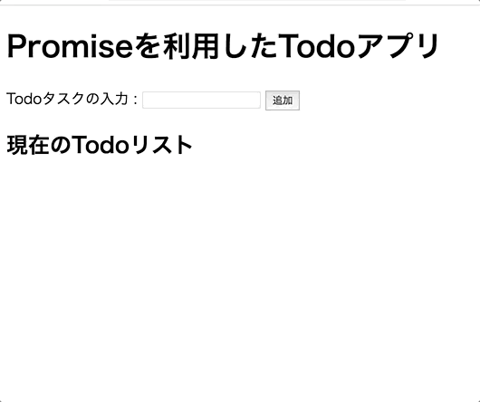

# レポジトリ内容

このレポジトリは[Web白熱教室](https://tsuyopon.xyz/)の[JavaScriptの学習コンテンツ > JavaScriptフロントエンド編](https://tsuyopon.xyz/learning-contents/web-dev/javascript/frontend/)にある「[【エクササイズ】Promiseを使ってTodoアプリを作成する【JavaScript】](https://tsuyopon.xyz/learning-contents/web-dev/javascript/frontend/js-excercise-for-frontend-6/)」で利用するものです。

### 完成形

## 課題

以下の「課題をクリアするためのステップ」の内容を全て対応して、`index.html`をブラウザで開き、上の完成形の画像と同じような機能を実装する。

また、今回の課題で作るものは「[【エクササイズ】DOM操作をしてTodoリストを作成する【JavaScript】](https://tsuyopon.xyz/learning-contents/web-dev/javascript/frontend/js-excercise-for-frontend-4/)」と似た内容になりますが、「[【エクササイズ】DOM操作をしてTodoリストを作成する【JavaScript】](https://tsuyopon.xyz/learning-contents/web-dev/javascript/frontend/js-excercise-for-frontend-4/)」との違いはPromiseを使っているか・使っていないかの差です。

今回の課題ではWebページで挙動が確認できることだけでなく、Promiseを正しく理解して使えているかについても確認します。

### 課題をクリアするためのステップ

1. [ ] main.jsの中のコメントに記述されている課題をクリアしてください。

## 答え

- 答えは `answer.html`, `answer.js` の中身になります。参考記事を読んでもわからなくなった場合は、答えの実装を見て、コードの流れを理解してからまたチャレンジしてみてください。(コピペ厳禁)

## 参考記事

課題をこなしていて、行き詰まったら以下の資料を参考にしていただければ解答にたどり着けるかと思います。

- Web白熱教室
  - [【JavaScript】Promiseで非同期を実装するメリット](https://tsuyopon.xyz/learning-contents/web-dev/javascript/frontend/promise-helps-us-from-callback-hell/)
  - [【JavaScript】Promiseオブジェクトを作成する](https://tsuyopon.xyz/learning-contents/web-dev/javascript/frontend/how-to-create-a-promise-object/)
  - [【JavaScript】Promiseのthenメソッドの使い方](https://tsuyopon.xyz/learning-contents/web-dev/javascript/frontend/how-to-use-the-then-of-a-promise-in-js/)
  - [【JavaScript】Promiseのcatchメソッドの使い方](https://tsuyopon.xyz/learning-contents/web-dev/javascript/frontend/how-to-use-the-catch-of-a-promise-in-js/)
